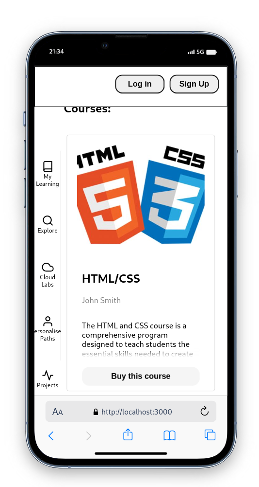

# eLearning Website

This is a eLearning platform, akin to Udemy or Pluralsight.

| Mobile View | Web View |
|---------|---------|
|  |  |

## Features

**IT IS A WORK IN PROGRESS**

- **TODO** User authentication: Users can create accounts, log in, and access personalized learning materials.
- **TODO** Course catalog: Users can browse and enroll in various courses offered on the platform.
- **TODO** Interactive lessons: Courses include interactive lessons, quizzes, and assignments to enhance the learning experience.
- **TODO** Progress tracking: Users can track their progress in courses and view completion certificates.
- **TODO** Discussion forum: Users can participate in course-specific discussion forums to ask questions and engage with fellow learners.

## Technologies Used

This website is built using the following technologies:

- [React](https://reactjs.org/): A JavaScript library for building user interfaces.
- [Pocketbase](https://www.pocketbase.io/): A cloud-based backend-as-a-service platform for managing data and user authentication.

## Getting Started

To get started with the eLearning Website, follow these steps:

1. Clone the repository: 
```shell
git clone https://github.com/your-username/elearning-website.git
```

2. Install dependencies:
```shell
npm install
```

3. Start the development server and API:
```shell
bash ./start.sh
```

5. Open your browser and navigate to http://localhost:3000 to access the eLearning Website.

## Folder Structure

The folder structure of this project is organized as follows:

```
elearning-website/
  ├── src/
  │   ├── components/       # React components
  │   ├── pages/            # Page components
  │   ├── services/         # Service modules (integration with Pocketbase)
  │   ├── App.js            # Main application component
  │   └── index.js          # Entry point for the application
  ├── public/               # Static assets
  ├── .env.example          # Example environment variables file
  ├── package.json          # Node.js dependencies and scripts
  └── README.md             # Project documentation
```

## Contributing

Contributions are welcome! If you find any issues or have suggestions for improvements, please create a new issue or submit a pull request.

When contributing to this project, please follow the existing code style and conventions. Additionally, ensure that all tests pass before submitting any changes.

## License

This project is licensed under the [MIT License](LICENSE).
